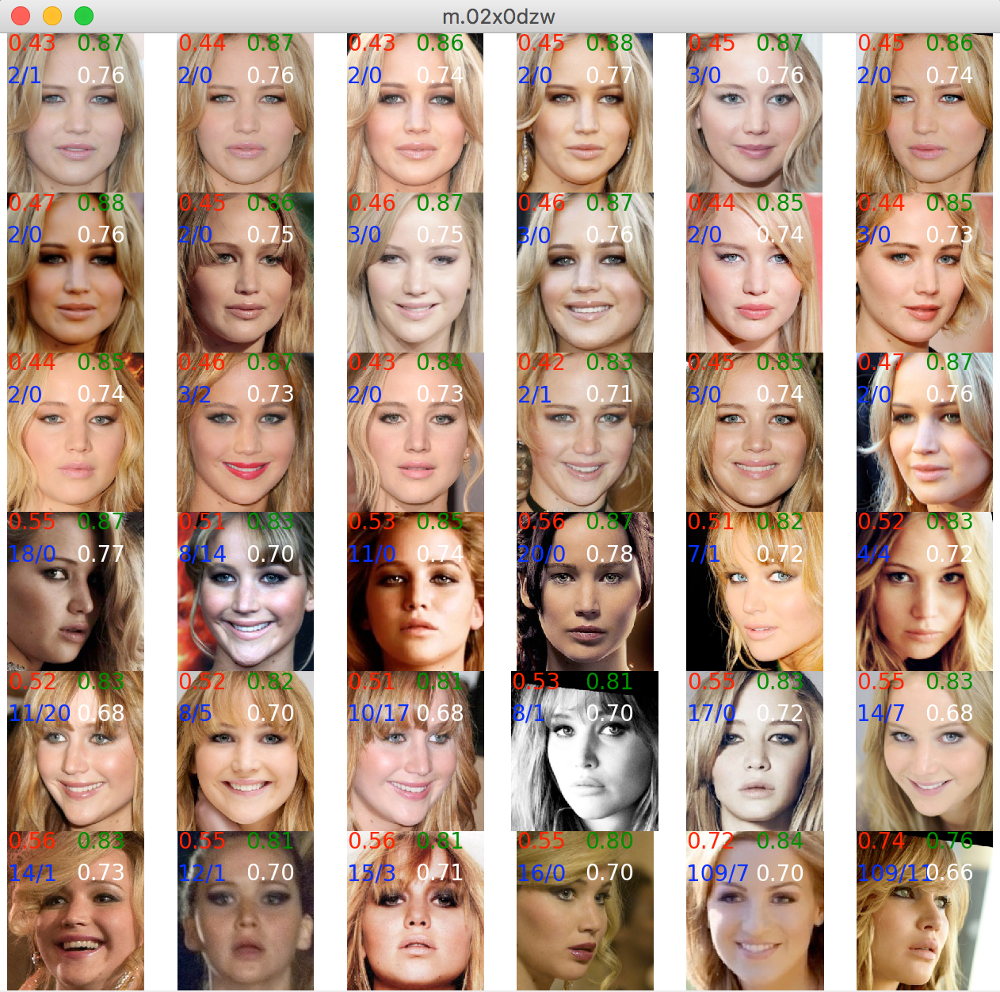

# Find best face

From a set of face images for a certain person, we want to find the face that
  - will match most other faces of the same person
  - will match least faces of other persons

Initial strategies:
  - Use facial landmarks to learn the best embedding possible
  - Or, maybe just use embeddings and calculate a good quality metric (see below)

## Conclusion (work in progress)

- After visualising faces ordered by quality, I cannot see what we can learn from landmarks - especially not landmark-5.
    A tiny doubt still exist for landmark-68, so maybe we should give it a try for the experience...

- A much better result will be obtained by calculating embeddings for all images.

  This will probably just be a factor of 2 or so slower. On an MBP 2016:
    - Detecting face bounds takes ~10 ms (needed for both landmark and embedding calculation)
    - Finding landmarks takes 1.5/3 ms (needed for embedding  calculation)
    - Calculating embeddings takes ~20 ms more.
    - All other calculation are relatively small in comparison

  Calculation of embedding to quality for one face image will require:
    - Detect face bounds, finding landmarks, calculate embeddings: ~32 ms
    - Calculate quality of matches with not too many images of the same and other persons will not take long 
    - If wee keep a properly sized pool (1000-10000?) of 'other' faces with embeddings nearby for quality measurments, 
      the quality calcualation will not take too long. 

# Install

* Install dlib: https://www.pyimagesearch.com/2017/03/27/how-to-install-dlib
* Download dlib models:  http://dlib.net/files
* Download some of MS-Celeb sample dataset
    - The aligned sample will do: https://msceleb.blob.core.windows.net/ms-celeb-v1-samples/MsCelebV1-Faces-Aligned.Samples.zip
    - For more info, see https://www.microsoft.com/en-us/research/project/ms-celeb-1m-challenge-recognizing-one-million-celebrities-real-world/ 

# Sample

The top 3 rows are the best fits, while the bottom 3 rows are the worst. 
Note that the two last images is identified as being of a different person (the MS-Celeb dataset contains a lot of misplaced faces).
  
The numbers on the images are:
 - red: average distance to all other faces of the same person.
 - blue: number of false negatives/false positives (own images that dont match/other images that match)
 - green: average distance to all other persons faces
 - white: average distance to the top 20% of other persons that look most like this person
  
Other features in this repo:
 - filter images from misplaced persons (to get rid of most false negatives above). 
 - show images that are not recognized as a face  
 - show all images per person (not just top 18 + bottom 18) 

# TODO

* Phase 0:
    - ? learn linear regression of facial landmarks to quality?
        - Check out https://machinelearningmastery.com/regression-tutorial-keras-deep-learning-library-python/
    - Decide on a simple, phase0 result metric
    - Visualize result

* Phase 1-n:
    - get hold of full MS-celeb - (if we are learning something)  
    - save intermediate qualities for faster cycling
    - Use 68-point landmarks (in stead of 5)
    - Deeper quality metrics. Example
        - ? should use (mean - stddev) when comparing own and others.
    - Try to keep more than one embedding for better results!
        - For instance: pick the two images that combined gived the best result!
        - Detect age and keep images with age diversity!

* Speed up figures  
* Unit tests
* Focus on reusable code
